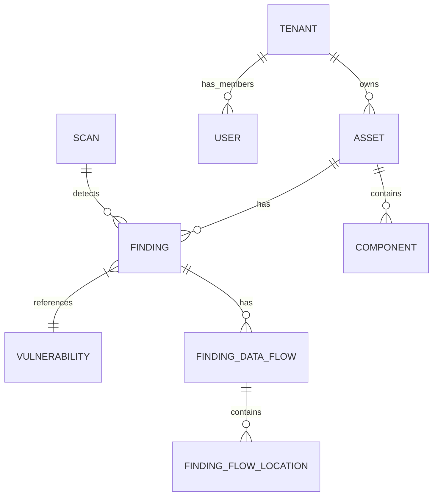

# Schema Overview

## Core Domains

### 1. Identity & Access (IAM)
- **`users`**: Global users table.
- **`tenants`**: Organization/Tenant boundaries.
- **`tenant_members`**: Link between users and tenants (role assignment).
- **`roles`**: RBAC role definitions.
- **`permissions`**: Granular system permissions.
- **`role_permissions`**: Mapping of permissions to roles.

### 2. Assets Management
- **`assets`**: Core entity (servers, clouds, apps).
- **`asset_types`**: Definitions of asset categories.
- **`asset_groups`**: Logical grouping of assets (tag-based or static).
- **`components`**: Software components/libraries installed on assets.

### 3. Vulnerability Management
- **`findings`**: Security issues found on assets. Includes `finding_type` discriminator for polymorphic behavior.
- **`finding_data_flows`**: Data flow traces for SAST findings (SARIF codeFlows).
- **`finding_flow_locations`**: Individual steps in data flow paths (source → intermediate → sink).
- **`vulnerabilities`**: Vulnerability definitions (CVEs).
- **`scans`**: Records of scan executions.
- **`scan_profiles`**: Configuration for scan jobs.

#### Finding Types and Specialized Columns

The `findings` table supports multiple finding types with specialized columns:

| Finding Type | Column Prefix | Description |
|--------------|---------------|-------------|
| `vulnerability` | (base columns) | SAST/SCA/DAST findings |
| `secret` | `secret_*` | Leaked credentials, API keys |
| `compliance` | `compliance_*` | CIS, PCI-DSS, SOC2 findings |
| `web3` | `web3_*` | Smart contract vulnerabilities |
| `misconfiguration` | `misconfig_*` | IaC/Infrastructure findings |

### 4. Operations
- **`agents`** (formerly workers): Distributed scan agents.
- **`audit_logs`**: System audit trail.
- **`jobs`**: Background job entries.

### 5. Platform Administration (Added v3.2)
- **`admin_users`**: Platform admin accounts with bcrypt API key auth.
- **`admin_audit_logs`**: Admin action audit trail (immutable).
- **`agent_leases`**: K8s-style lease management for platform agents.
- **`platform_agent_bootstrap_tokens`**: One-time registration tokens.
- **`platform_agent_registrations`**: Agent registration audit trail.

### 6. Pipelines & Scans
- **`pipelines`**: Scan pipeline templates.
- **`pipeline_steps`**: Steps within a pipeline.
- **`pipeline_runs`**: Pipeline execution instances.
- **`step_runs`**: Individual step execution records.
- **`commands`**: Job queue for agents (includes platform jobs).

## Relationships Diagram



## Fingerprint Strategy

Findings use type-aware fingerprinting for deduplication:

| Strategy | Components | Use Case |
|----------|------------|----------|
| SAST/v1 | assetID + ruleID + filePath + normalizedSnippet | Resilient to line shifts |
| SCA/v1 | assetID + PURL + CVE | Package-based identity |
| DAST/v1 | assetID + ruleID + endpoint + parameter | URL-based identity |
| Secret/v1 | assetID + secretType + service + hash(maskedValue) | Credential identity |
| Compliance/v1 | assetID + framework + controlID | Control-based identity |
| Misconfig/v1 | assetID + policyID + resourceType + resourcePath | Resource-based identity |
| Web3/v1 | chainID + contractAddress + SWCID + functionSelector | Contract-based identity |

Fingerprints are stored in `findings.fingerprint` (primary) and `findings.partial_fingerprints` (JSONB, for multi-algorithm support).

> **Security Note**: The Secret/v1 strategy uses a SHA-256 hash of the masked value (not the raw secret) to prevent credential exposure.

## Security Considerations

### Tenant Isolation

All data flow queries enforce tenant isolation through JOIN with the `findings` table:

```sql
-- REQUIRED: All flow location queries must include tenant_id filter
SELECT fl.* FROM finding_flow_locations fl
JOIN finding_data_flows df ON df.id = fl.data_flow_id
JOIN findings f ON f.id = df.finding_id
WHERE fl.file_path = $1 AND f.tenant_id = $2;  -- tenant_id is mandatory
```

### Data Flow Location Types

Location types are validated at both domain and database levels:

| Type | Description | Validation |
|------|-------------|------------|
| `source` | Where tainted data enters | Domain constant + DB constraint |
| `intermediate` | Data transformation steps | Domain constant + DB constraint |
| `sink` | Where vulnerability occurs | Domain constant + DB constraint |
| `sanitizer` | Where data is sanitized | Domain constant + DB constraint |

### Secret Fingerprinting

The secret fingerprint strategy never uses raw secrets:

1. Uses hash of `metadata.masked_value` from scanner output
2. Falls back to `ruleID + startLine` if no masked value available
3. Never uses `snippet` field which may contain the full secret
